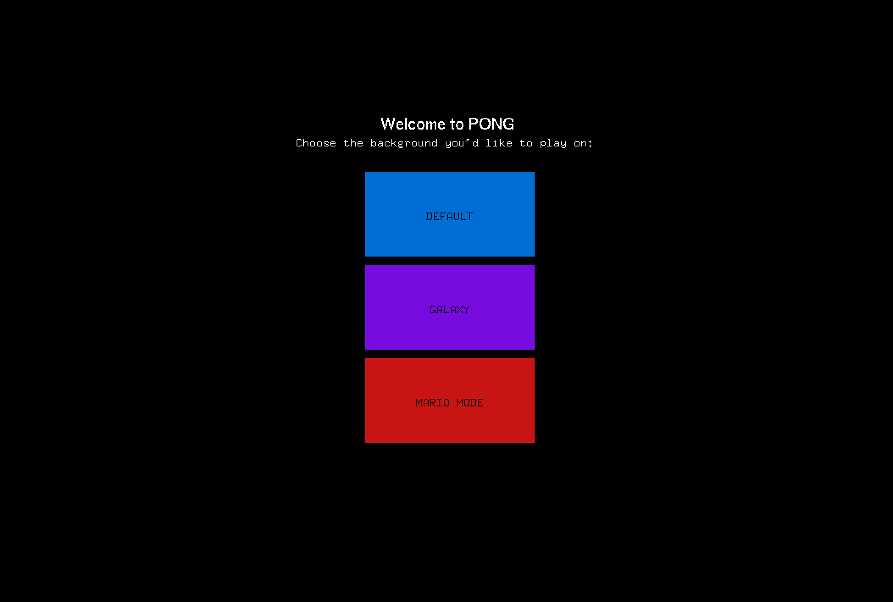
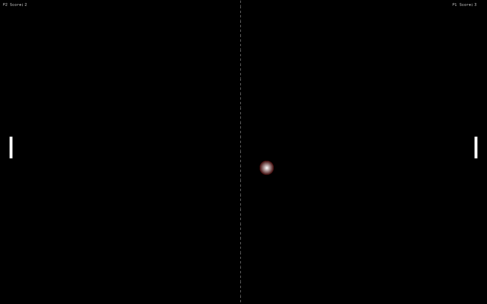

# Atari_Pong

---
## Description
The final project assignment for my advanced programming class was to create a complex
project that utilized two large concepts from the course material. I decided to implement
the concepts of inheritance and polymorphism with our knowledge of OpenGL graphics to recreate
Atari's Pong game. For those who don't know, Pong is a simple digital recreation of table tennis, 
and it was also Atari's first ever video game to be released. When recreating this game
I wanted to put my own spin on it by allowing the user to choose from a series of three different
backgrounds to play on. I also made the game a bit harder by having the users slowly move closer
to each other once two minutes of game time has passed. Overall, I had a great time creating this project
as prior to this I had limited game development knowledge, It was especially fun using the different backgrounds to
display the various components of graphics I learned using GLUT and OpenGL.

## Setup Instructions
To run this game, OpenGL and GLUT are required. This project was compiled using 
CMake, in order to do so as well <mark style="background-color: #ADD8E6">freeglut.dll</mark> 
has to be included in your debug folder. This project has been configured to run natively
on macOS only, it may not compile and run on a Windows machine.

## How To Play
When the game is booted up, it will take up your full screen. The user will be greeted with 
a menu that will allow them to choose the background to play Pong on. The default option is
the plain old black screen that Atari Pong used to be played on. The galaxy option is a bit more dynamic
as it includes twinkling stars falling from the sky, giving the game an outer space or galaxy-like effect.
The last option is mario mode, which includes an 8-bit recreation of mario's world in the background. Once
you have selected a background to play on, you will arrive at the start screen. To begin playing, 
press <mark style="background-color: #ADD8E6">enter</mark>. Both players should be ready to receive the 
serve as the ball's initial velocity and direction is random. The right player (player 1) uses the
<mark style="background-color: #ADD8E6">UP</mark> and <mark style="background-color: #ADD8E6">DOWN</mark>
arrow keys to move up and down. The left player (player 2) uses the <mark style="background-color: #ADD8E6">w</mark>
and <mark style="background-color: #ADD8E6">s</mark> keys to move up and down. The game will end once the score 
limit of 7 is reached. The score limit can be changed by changing the <mark style="background-color: #ADD8E6">finalScore</mark>
variable at the top of <mark style="background-color: #ADD8E6">graphics.cpp</mark>. Once the score is reached, you will arrive at 
end screen, which will display who won. If the game lasts longer than 2 minutes, both users begin to move closer to the center,
making the game a bit more challenging. You can press <mark style="background-color: #ADD8E6">esc</mark> at any moment to exit 
the game.